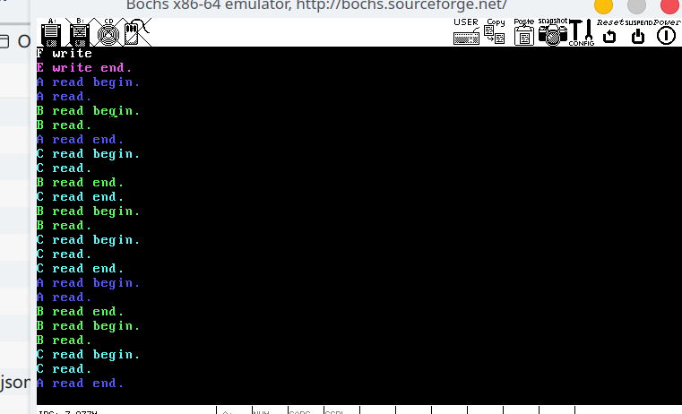

# OS-Lab-4 系统调用与 PV 操作

## 说明

之前在 Manjaro 上怎么都不成功, 总算是改好了

时间片轮转调度, 不该执行的进程移出就绪队列

读者写者
 - 读者优先
 - 写者优先
 - 公平读写

## 环境

- OS: Manjaro Linux x86_64

- VGA BIOS - Version 2.40
- Bochs 2.7 BIOS - build: 08/01/21
- gcc 11.1.0 

## 编写及调试

- neovim (通过 `nvim-dap` 进行调试)
- bochs (需要 `./configure --enable-gdb-stub` 重新编译安装)
- gdb
